<div align="center">

# FinWise AI

**Intelligent Loan Eligibility, Credit Analysis & Financial Advisory Platform**

[](https://astro.build)
[](https://www.typescriptlang.org/)
[](https://tailwindcss.com/)
[](https://groq.com)
[](https://vercel.com)

</div>

---

## About

FinWise AI is a production-inspired AI-powered fintech web application that combines **deterministic financial calculations** with **generative AI guidance**. Users can evaluate loan eligibility, analyze credit scores, calculate EMIs, and receive personalized financial recommendations — all through a dark, glassmorphic SaaS-grade interface.

Every financial formula (loan eligibility, EMI, credit analysis) is computed **locally with transparent, auditable logic**. The AI layer only provides reasoning, explanations, and recommendations — it never replaces or recomputes the numbers.

> Built for the **SmartBridge Vibe Coding Internship** and engineered to read as a real fintech product, not a student assignment.

---

## 🎥 Project Demo

Watch the complete walkthrough:

[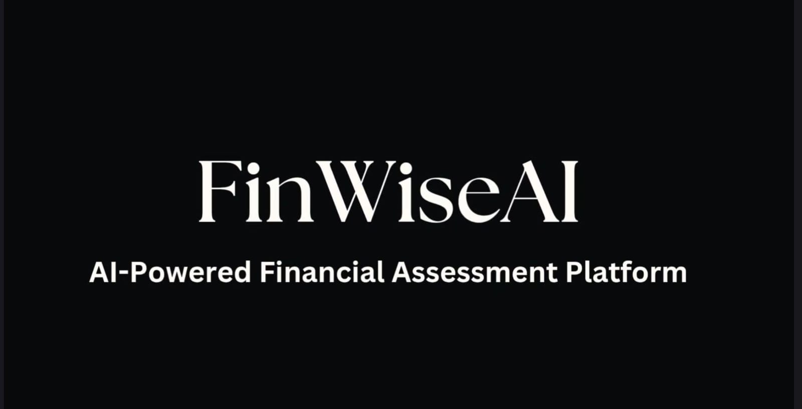](demo/FinWiseAI-Demo.mp4)

> ▶ [Play the demo video](https://github.com/user-attachments/assets/f3e66b84-7941-4476-af21-d2957496e70d)

The demo showcases:

- Landing Page
- Dashboard
- Loan Eligibility Checker
- Credit Score Analyzer
- EMI Calculator
- AI Financial Advisor
- Google Sheets Cloud Sync
- History Management
- Notifications
- Responsive Design

---
## 🌐 Live Demo

Experience FinWise AI live:

**🔗 Live Application:** https://finwise-ai-blue.vercel.app/

---

## 📄 Documentation

- [Open Project Documentation (PDF)](docs/FinWise_AI_Internship_Report.pdf)
- [Features](docs/FEATURES.md) · [Setup](docs/SETUP.md) · [API](docs/API.md) · [Architecture](docs/ARCHITECTURE.md) · [Testing](docs/TESTING.md) · [Deployment](docs/DEPLOYMENT.md)

---

## Features

| Module | Description | Deterministic | AI-Powered |
|---|---|---|---|
| Loan Eligibility Checker | Estimates borrowing capacity, risk band, DTI, and indicative EMI | Yes | Advisory only |
| Credit Score Analyzer | Classifies score into rating bands, computes health index, approval odds | Yes | Advisory only |
| EMI Calculator | Reducing-balance EMI, total interest, principal/interest breakdown | Yes | Advisory only |
| AI Financial Advisor | Personalized advice, risk assessment, suggestions, action plan | Reads results | Yes |
| Financial Dashboard | KPI overview, recent activity, quick actions, AI insights | Placeholder | Preview |
| Analysis History | Cloud-synced record list with search, filter, detail modal | Yes | Stored advice |
| Google Sheets Sync | Offline-first persistence with automatic cloud reconciliation | Yes | — |

---

## Screenshots

| | | |
|---|---|---|
| 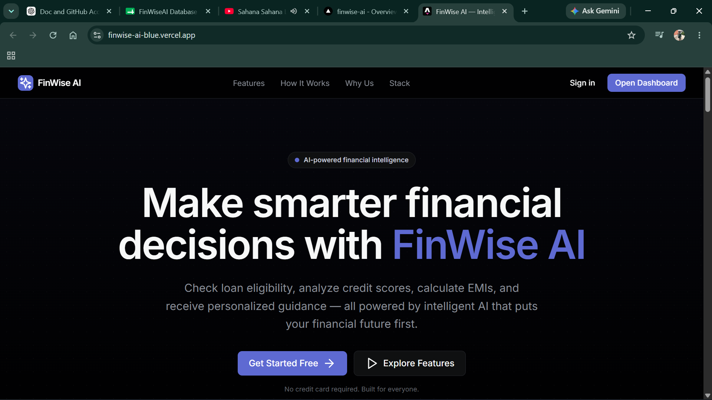 | 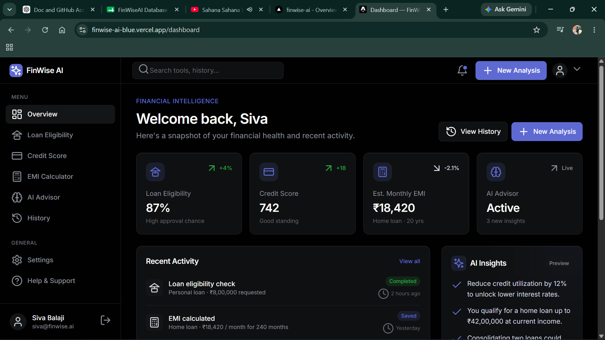 | 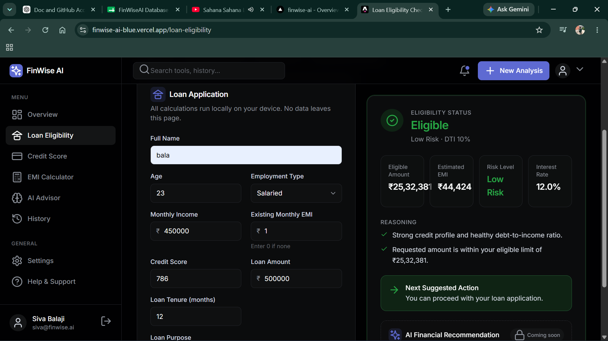 |
| 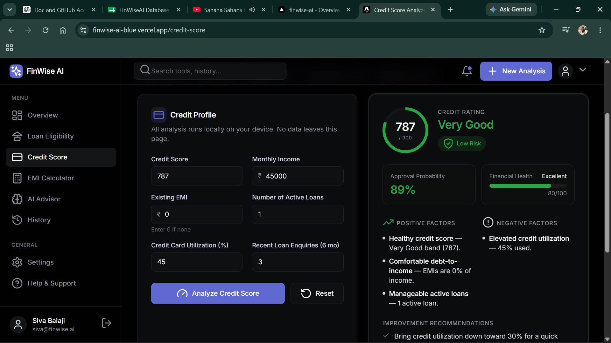 | 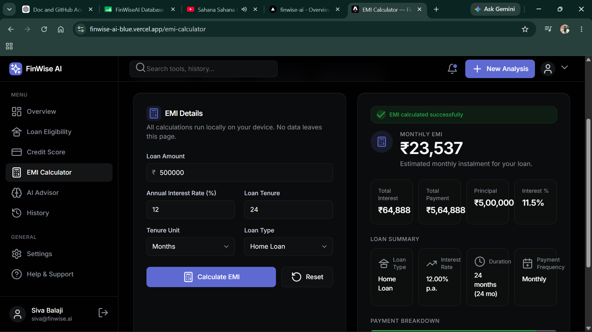 | 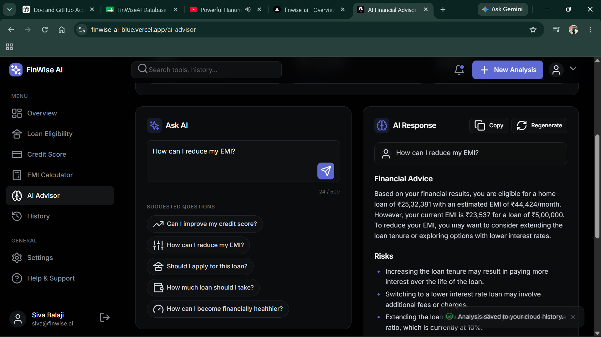 |
| 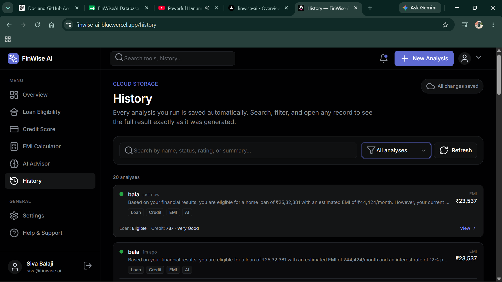 | 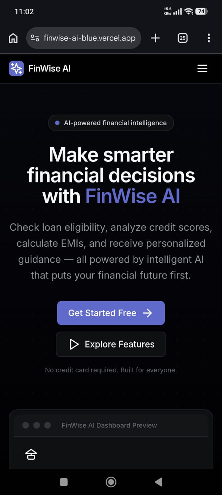 | 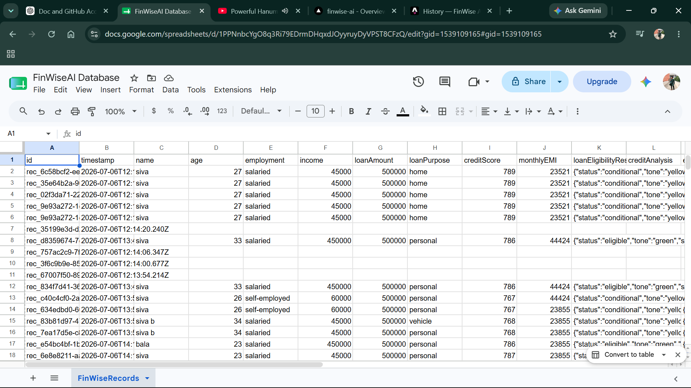 |
| 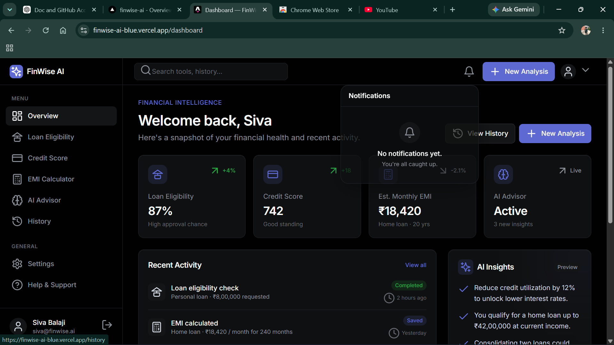 | | |


---

## Architecture

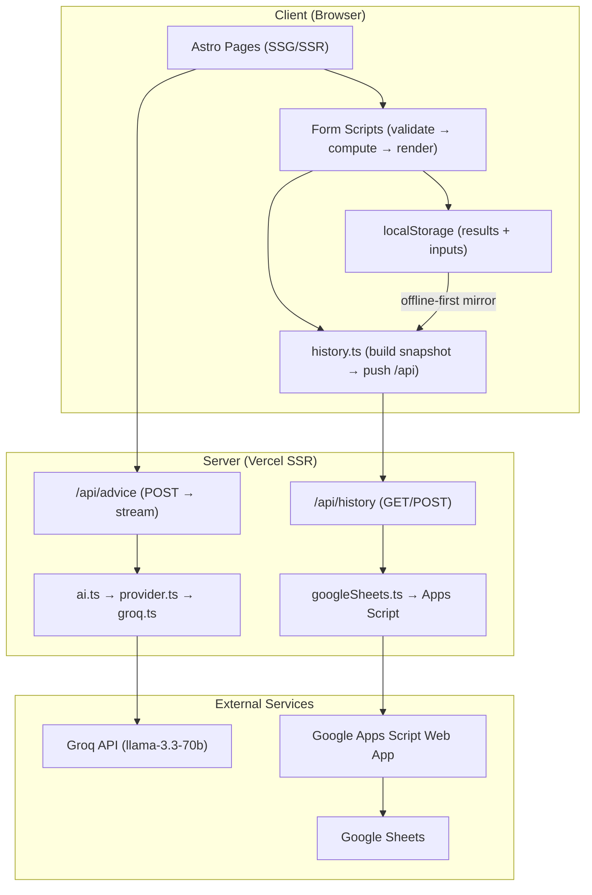

### Key Architectural Decisions

- **Zero client-side hydration** by default — Astro pre-renders every page; only `<script>` blocks run on interaction.
- **API keys stay on the server** — `GROQ_API_KEY` and `GOOGLE_SCRIPT_URL` are never shipped to the browser. The client calls `/api/advice` and `/api/history` as proxies.
- **Offline-first history** — every analysis is saved to `localStorage` first, then pushed to the cloud. If the network fails, the record stays queued and syncs automatically when connectivity returns.
- **Business logic is pure** — all financial calculations live in `src/utils/` with no UI dependencies. The AI receives results as read-only context, never recomputing them.

---

## Project Structure

```
src/
├── components/          # Reusable UI components
│   ├── dashboard/       #   Sidebar, TopBar, KpiCard, etc.
│   ├── Field.astro      # Shared form field (input / select)
│   ├── Icon.astro       # Inline SVG icon registry
│   ├── Navbar.astro     # Landing navigation
│   └── ...               # Hero, Features, Footer, etc.
├── features/            # Feature-specific form + result pairs
│   ├── loan/            #   LoanForm + LoanResult
│   ├── credit/          #   CreditForm + CreditResult
│   ├── emi/             #   EmiForm + EmiResult
│   └── advisor/         #   AskAi + AiResponse + FinancialSummary + SessionHistory
├── services/            # Server-side orchestration
│   ├── ai.ts            #   Public entry point for AI (single function)
│   ├── provider.ts      #   Provider selector (swap Groq → Claude in one line)
│   ├── groq.ts          #   Groq SSE streaming implementation
│   ├── advisor-prompt.ts#   Prompt engineering (pure functions)
│   ├── history.ts       #   Client-side snapshot builder + sync
│   ├── googleSheets.ts  #   Server-side sanitizer + Apps Script transport
│   └── types.ts         #   AnalysisRecord, AnalysisSource, sync types
├── utils/               # Pure, deterministic business logic
│   ├── loan.ts           #   EMI formula, eligibility engine, formatInr
│   ├── loan-validation.ts#   Field-level validation (raw → typed)
│   ├── credit.ts         #   Scoring bands, health index, approval odds
│   ├── credit-validation.ts
│   ├── emi.ts            #   Breakdown calculator (shared calculateEmi)
│   ├── emi-validation.ts
│   ├── parse.ts          #   Shared toNumber helper
│   ├── result-store.ts   #   localStorage bridge (results + inputs)
│   ├── persist-analysis.ts#  Auto-save trigger + toast
│   ├── history-format.ts #   Presentation helpers for History UI
│   ├── markdown.ts       #   Safe Markdown → HTML renderer
│   └── toast.ts          #   Glassmorphism toast notifications
├── types/               # Pure data contracts
│   ├── loan.ts           #   LoanApplication, EligibilityResult, RiskLevel
│   ├── credit.ts         #   CreditProfile, CreditAnalysis, ResultTone
│   ├── emi.ts            #   EmiInput, EmiResult, LoanType = LoanPurpose
│   ├── advisor.ts        #   FinancialContext, AdviceRequest, AiProvider
│   └── dashboard.ts      #   KpiCard, ActivityItem, SidebarLink
├── layouts/
│   ├── Layout.astro      #   HTML shell + global.css + fonts
│   └── DashboardLayout.astro# Sidebar + TopBar wrapper
├── pages/               # Route definitions
│   ├── index.astro       #   Landing page
│   ├── dashboard.astro   #   Financial Intelligence Dashboard
│   ├── loan-eligibility.astro
│   ├── credit-score.astro
│   ├── emi-calculator.astro
│   ├── ai-advisor.astro  #   Streaming chat UI + session history
│   ├── history.astro     #   Cloud-synced record list + detail modal
│   ├── settings.astro    #   Placeholder
│   ├── help.astro        #   Placeholder
│   └── api/
│       ├── advice.ts     #   POST → streamed AI response (SSR-only)
│       └── history.ts    #   GET/POST → Google Sheets proxy (SSR-only)
├── styles/
│   └── global.css        #   Tailwind v4 @theme tokens + component classes
public/
├── favicon.svg
├── favicon.ico
docs/
├── google-apps-script.gs # Deploy this as a Google Apps Script Web App
```

### Repository-level layout

```
FinWiseAI/
├── app/                    # The Astro application (source above)
├── demo/
│   └── FinWiseAI-Demo.mp4  # Full walkthrough video
├── docs/                   # Project documentation
│   ├── ARCHITECTURE.md
│   ├── API.md
│   ├── DEPLOYMENT.md
│   ├── FEATURES.md
│   ├── SETUP.md
│   ├── TESTING.md
│   ├── FinWise_AI_Internship_Report.pdf
│   └── screenshots/
│       ├── landing.png
│       ├── dashboard.png
│       ├── loan-eligibility.png
│       ├── credit-score.png
│       ├── emi-calculator.png
│       ├── ai-advisor.png
│       ├── history.png
│       ├── notifications.png
│       ├── mobile_view.png
│       └── google_sheet.png
└── README.md
```

### Documentation index

| Document | Contents |
|---|---|
| [FEATURES.md](docs/FEATURES.md) | Complete, implementation-accurate feature list |
| [SETUP.md](docs/SETUP.md) | Prerequisites, install, env vars, run/build/preview, troubleshooting |
| [API.md](docs/API.md) | Every API route: request, response, errors, streaming, security |
| [ARCHITECTURE.md](docs/ARCHITECTURE.md) | Architecture, data flow, provider abstraction, Mermaid diagrams |
| [TESTING.md](docs/TESTING.md) | Test cases and expected outputs across all layers |
| [DEPLOYMENT.md](docs/DEPLOYMENT.md) | Vercel + Google Apps Script deployment and checklist |

---

## Tech Stack

| Layer | Technology | Purpose |
|---|---|---|
| Framework | [Astro 7](https://astro.build) | SSG/SSR with zero client JS by default |
| Language | [TypeScript 6](https://www.typescriptlang.org/) | Strict typing across the entire codebase |
| Styling | [Tailwind CSS v4](https://tailwindcss.com) | Utility-first design tokens via `@theme` |
| AI | [Groq](https://groq.com) (llama-3.3-70b-versatile) | Streaming chat completions for the advisor |
| Icons | [Lucide](https://lucide.dev) | Inline SVG registry in `Icon.astro` |
| Database | [Google Sheets](https://sheets.google.com) | Cloud persistence via Apps Script Web App |
| Backend | [Google Apps Script](https://script.google.com) | Serverless CRUD API for Sheets |
| Deployment | [Vercel](https://vercel.com) | SSR adapter for on-demand API routes |
| Version Control | Git + GitHub | Source management |

---

## AI Architecture

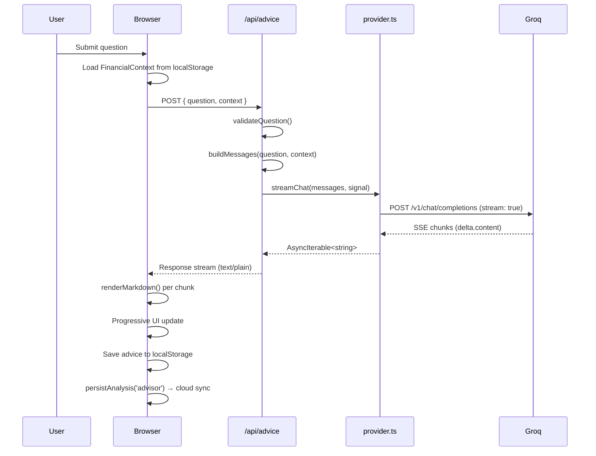

### Provider Abstraction

The AI layer follows a **single-switch-point** pattern:

- `provider.ts` selects `groqProvider` as `activeProvider`
- `ai.ts` calls only `activeProvider.streamChat()` — it never imports Groq directly
- To swap providers: create a new file (e.g., `services/claude.ts`) implementing the `AiProvider` interface, then change one line in `provider.ts`

### Prompt Engineering

`advisor-prompt.ts` is pure functions — no provider, no network. It builds a system prompt that:
- Instructs the model to treat user's deterministic results as **authoritative facts** (never recalculate)
- Structures the output into four headings: Financial Advice, Risks, Suggestions, Action Plan
- Enforces concise output (~350 words) with no preamble

---

## Google Sheets Architecture

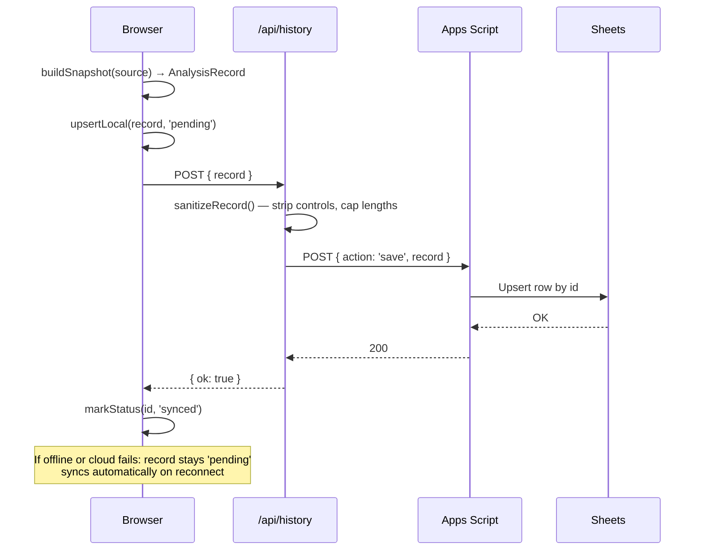

### Offline-First Design

- Every analysis is saved to `localStorage` **first** — results are never lost
- A `syncPending()` flush pushes queued records to `/api/history` on reconnect
- `window.addEventListener('online', ...)` triggers automatic background sync
- If `GOOGLE_SCRIPT_URL` is not configured, records remain local-only and History still works

### Server-Side Sanitization

`googleSheets.ts` validates every incoming record before forwarding to Apps Script:
- Strips ASCII control characters (keeps tab/newline)
- Caps string lengths (max 2000 chars; advice max 8000)
- Drops unknown fields
- Validates `source` against the `AnalysisSource` union

---

## Installation

```bash
git clone https://github.com/<your-username>/FinWiseAI.git
cd FinWiseAI/app
npm install
```

---

## Environment Variables

Copy `.env.example` to `.env` and fill in your values:

```bash
cp .env.example .env
```

| Variable | Required | Description |
|---|---|---|
| `GROQ_API_KEY` | Yes | Groq API key for the AI advisor. Get one at [console.groq.com](https://console.groq.com/keys). Server-side only — never shipped to the browser. |
| `GOOGLE_SCRIPT_URL` | No | URL of your deployed Apps Script Web App. If unset, history is stored locally only. |
| `GOOGLE_SCRIPT_TOKEN` | No | Shared secret for authenticating writes. Match this in the Apps Script `SCRIPT_TOKEN` property. |

> **Security:** Neither `GROQ_API_KEY` nor `GOOGLE_SCRIPT_URL` is prefixed with `PUBLIC_`. Astro only exposes `PUBLIC_*` variables to the client bundle; these stay server-only.

---

## Running Locally

```bash
npm run dev
```

Opens at `http://localhost:4321`. The AI advisor and Google Sheets endpoints run on-demand via the Vercel adapter in dev mode.

Other commands:

| Command | Action |
|---|---|
| `npm run build` | Production build to `./dist/` |
| `npm run preview` | Preview the production build locally |
| `npx astro check` | Type-check all `.astro` and `.ts` files |

---

## Deploying on Vercel

1. Push the repository to GitHub
2. Import the project in [Vercel](https://vercel.com/new)
3. Set the root directory to **`app`** (the Astro project lives inside `app/`)
4. Add environment variables in Vercel's dashboard:
   - `GROQ_API_KEY`
   - `GOOGLE_SCRIPT_URL` (optional)
   - `GOOGLE_SCRIPT_TOKEN` (optional)
5. Deploy

The `@astrojs/vercel` adapter is already configured in `astro.config.mjs`. Pre-rendered pages (landing, dashboard, calculators, history) serve as static HTML; only `/api/advice` and `/api/history` run as serverless functions.

### Google Sheets Setup

1. Create a Google Sheet with columns matching `AnalysisRecord` fields
2. Deploy the script in `docs/google-apps-script.gs` as a Web App (Execute as: Me, Access: Anyone)
3. Paste the `/exec` URL into `GOOGLE_SCRIPT_URL`

---

## Future Improvements

- Authentication system (user login, profile, per-user history)
- Interactive charts (payment amortization schedule, credit trend over time)
- AI EMI optimization (pre-payment suggestions, balance transfer analysis)
- Light mode toggle
- Mobile PWA with offline calculator
- Real-time collaborative analysis (share results with a advisor/friend)
- End-to-end testing with Playwright

---

## Learning Outcomes

This project provided hands-on experience with:

- **Astro** — SSG/SSR hybrid, zero-hydration islands, layout nesting, API endpoints
- **TypeScript** — strict typing, discriminated unions, generic utilities, runtime type guards
- **Tailwind CSS v4** — `@theme` design tokens, utility-first composition, dark-first styling
- **AI Integration** — prompt engineering, provider abstraction, SSE streaming, client/server boundary
- **Component Architecture** — feature-based folders, reusable `<Field>` and `<Icon>`, separation of concerns
- **Cloud Persistence** — Google Apps Script, offline-first localStorage, automatic sync
- **Modern Frontend** — accessibility, progressive enhancement, responsive design, glassmorphism

---

## Author

**Siva Balaji**

- Product Owner & Developer
- SmartBridge Vibe Coding Internship Participant

---

## 📬 Contact

**Siva Balaji** — B.Tech CSE (AI & ML)
Machine Learning Enthusiast · Python · Data Science

- LinkedIn: *[linkedin.com/in/m-siva-balaji](https://www.linkedin.com/in/m-siva-balaji/)*
- GitHub: *[github.com/Siva9493-tech](https://github.com/Siva9493-tech)*

---

## License

This project is developed for educational and portfolio purposes as part of the SmartBridge Vibe Coding Internship. All rights reserved by the author.
