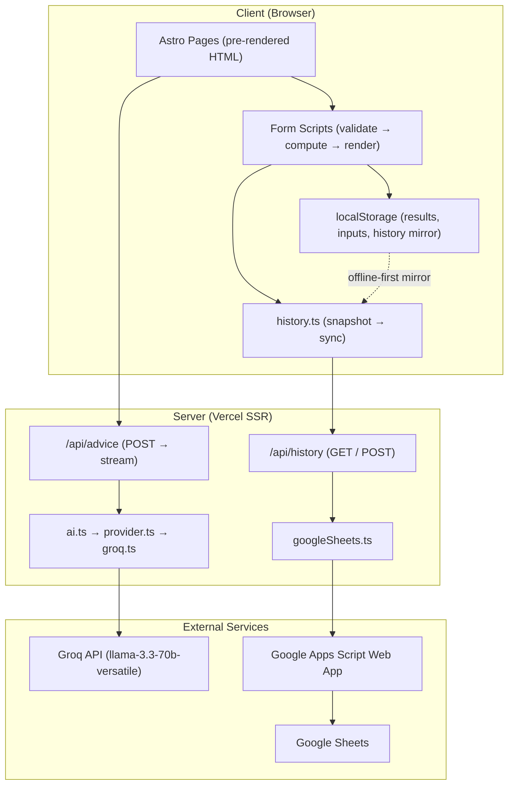
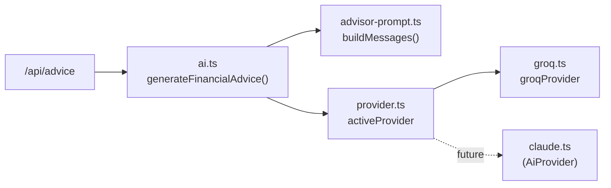
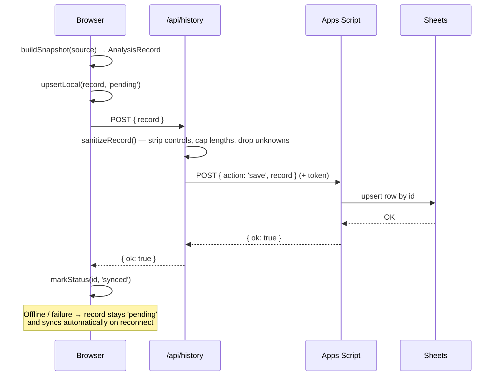
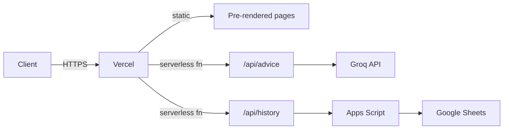

# Architecture

FinWise AI is a hybrid Astro application: most pages are pre-rendered static HTML, while two routes run on-demand on the server to keep secrets off the client. This document explains the overall shape, the folder layout, how data flows, and the key abstractions.

---

## Overall Architecture



### Key Decisions

- **Zero client hydration by default** — Astro pre-renders every page; only `<script>` blocks run on interaction.
- **Secrets stay server-side** — `GROQ_API_KEY` and `GOOGLE_SCRIPT_URL` are only read in server-only modules. The client proxies through `/api/advice` and `/api/history`.
- **Pure business logic** — all calculations live in `src/utils/` with no UI or AI dependency, so they are reproducible and testable in isolation.
- **Offline-first history** — analyses are saved locally first, then synced to the cloud with automatic retry.

---

## Folder Structure

```
app/src/
├── components/          # Reusable UI (Navbar, Hero, Field, Icon, dashboard/*)
├── features/            # Feature form + result pairs
│   ├── loan/  credit/  emi/  advisor/
├── services/            # Server + client orchestration
│   ├── ai.ts            #   Single public AI entry point
│   ├── provider.ts      #   Provider selector (one switch point)
│   ├── groq.ts          #   Groq SSE streaming (only file touching Groq)
│   ├── advisor-prompt.ts#   Pure prompt engineering
│   ├── history.ts       #   Client snapshot builder + sync (offline-first)
│   ├── googleSheets.ts  #   Server sanitizer + Apps Script transport
│   └── types.ts         #   AnalysisRecord + sync contracts
├── utils/               # Pure, deterministic business logic
│   ├── loan.ts  credit.ts  emi.ts  (+ *-validation.ts)
│   ├── result-store.ts persist-analysis.ts history-format.ts
│   └── markdown.ts  parse.ts  toast.ts
├── types/               # Pure data contracts (loan, credit, emi, advisor, dashboard)
├── layouts/             # Layout.astro, DashboardLayout.astro
├── pages/               # Routes, including api/advice.ts and api/history.ts
└── styles/global.css    # Tailwind v4 @theme tokens
```

Layering rule: **`pages` → `features`/`components` → `services` → `utils`/`types`**. Utilities never import UI; UI never imports a provider directly.

---

## Data Flow

### A calculation

1. A form page validates raw input (`*-validation.ts`).
2. It calls the pure engine (`utils/loan.ts` / `credit.ts` / `emi.ts`) to compute a rich result object.
3. The result and inputs are cached in `localStorage` via `result-store.ts`.
4. `persist-analysis.ts` triggers an auto-save through `history.ts`, which builds a snapshot and syncs it.

### An AI request

1. The advisor page loads the cached `FinancialContext` from `localStorage`.
2. It `POST`s `{ question, context }` to `/api/advice`.
3. The server validates, builds messages, and streams from Groq, re-emitting text chunks.
4. The browser renders Markdown progressively and saves the advice for the next snapshot.

---

## AI Provider Abstraction

The AI layer uses a **single switch point** so the provider can be swapped without touching the rest of the app.



- Everything above `provider.ts` depends only on the `AiProvider` interface (`streamChat(messages, signal)`).
- To adopt a new provider: add a file implementing `AiProvider`, then change one line — `export const activeProvider = …` — in [`provider.ts`](../app/src/services/provider.ts).
- `advisor-prompt.ts` is pure: no network, no provider. It fixes the output contract (four headings) and injects the user's results as authoritative facts.

---

## Google Sheets Architecture



- The Apps Script ([`docs/google-apps-script.gs`](../app/docs/google-apps-script.gs)) stores each record as denormalized columns plus a full JSON snapshot column, and upserts by `id`.
- The browser never sees the script URL — only the server-side `googleSheets.ts` reads it.

---

## Offline-First History

The client (`history.ts`) treats `localStorage` as the working source of truth and the cloud as the durable one:

- `autoSave()` writes locally first (results are never lost), then attempts a cloud push; failures leave the record `pending`.
- `syncPending()` flushes queued records; it is wired to the `window.online` event and an opportunistic post-load flush.
- `loadHistory()` reconciles: when online with a configured backend, the cloud list **replaces** the mirror (plus any still-unsynced local records), so records deleted server-side don't linger. When offline or unconfigured, the local mirror is preserved untouched.

---

## Deployment Architecture



Pre-rendered pages serve as static HTML; only `/api/advice` and `/api/history` run as serverless functions via the `@astrojs/vercel` adapter.
