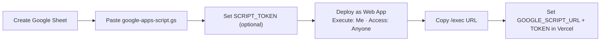
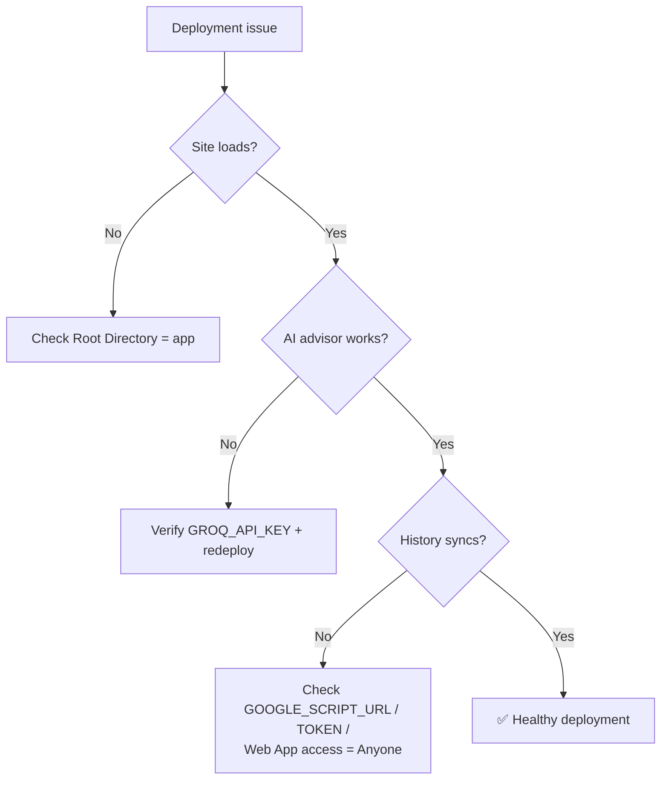

# Deployment

FinWise AI deploys to **Vercel** (front end + serverless API routes) with an optional **Google Apps Script + Google Sheets** backend for cloud history. This guide covers both, plus a production checklist and troubleshooting.

---

## 1. Vercel Deployment

The app uses the `@astrojs/vercel` adapter (already configured in [`astro.config.mjs`](../app/astro.config.mjs)). Pre-rendered pages ship as static HTML; only `/api/advice` and `/api/history` become serverless functions.

### Steps

1. Push the repository to GitHub.
2. In [Vercel](https://vercel.com/new), **Import** the repository.
3. Set the **Root Directory** to **`app`** — the Astro project is not at the repo root. *(This is the single most common misconfiguration.)*
4. Confirm framework settings (auto-detected):

   | Setting | Value |
   |---|---|
   | Framework Preset | Astro |
   | Build Command | `npm run build` |
   | Output Directory | `dist` |
   | Install Command | `npm install` |
   | Node version | ≥ 22.12.0 |

5. Add environment variables (below).
6. **Deploy.**

---

## 2. Environment Variables

Set these in **Vercel → Project → Settings → Environment Variables** (and in local `.env` for development):

| Variable | Required | Description |
|---|---|---|
| `GROQ_API_KEY` | **Yes** | Groq API key for the AI advisor. Server-side only. |
| `GOOGLE_SCRIPT_URL` | No | Deployed Apps Script `/exec` URL. If unset, history is local-only. |
| `GOOGLE_SCRIPT_TOKEN` | No | Shared secret for authenticating writes. Must match the Apps Script `SCRIPT_TOKEN`. |

> None are prefixed with `PUBLIC_`, so they never reach the client bundle. Redeploy after changing environment variables.

---

## 3. Google Apps Script Deployment

To enable cloud history, deploy the script in [`docs/google-apps-script.gs`](../app/docs/google-apps-script.gs):

1. Create a new **Google Sheet** (this becomes your database).
2. **Extensions → Apps Script**. Delete the default code and paste the contents of `google-apps-script.gs`.
3. *(Optional but recommended)* **Project Settings → Script Properties** → add a property named `SCRIPT_TOKEN` with a random value.
4. **Deploy → New deployment → Web app**:
   - **Execute as:** Me
   - **Who has access:** Anyone
5. Copy the Web App **`/exec` URL**.



---

## 4. Google Sheets Configuration

The script auto-creates a sheet named **`FinWiseRecords`** with these columns on first write:

```
id · timestamp · name · age · employment · income · loanAmount ·
loanPurpose · creditScore · monthlyEMI · loanEligibilityResult ·
creditAnalysis · emiCalculation · aiAdviceSummary · device · version · record
```

- The `record` column holds the full JSON snapshot; the others are denormalized for readability.
- Records are **upserted by `id`**, so re-saving updates the same row.
- No manual header setup is required — the script handles it.

---

## 5. Production Checklist

- [ ] Vercel **Root Directory** is set to `app`.
- [ ] `GROQ_API_KEY` is set in Vercel and valid.
- [ ] Build passes locally (`npm run build`) and on Vercel with no errors.
- [ ] `npx astro check` reports no type errors.
- [ ] AI advisor streams correctly in the deployed environment.
- [ ] *(If using cloud history)* `GOOGLE_SCRIPT_URL` set and a test record reaches the sheet.
- [ ] *(If using auth)* `GOOGLE_SCRIPT_TOKEN` matches the Apps Script `SCRIPT_TOKEN`.
- [ ] No secrets appear in the client bundle (search the deployed JS for the key — it should be absent).
- [ ] Screenshots / demo assets load from `docs/` and `demo/`.

---

## Common Deployment Issues

| Symptom | Cause | Fix |
|---|---|---|
| 404 / blank site on Vercel | Root directory not `app` | Set Root Directory to `app` and redeploy |
| AI advisor 503 in production | `GROQ_API_KEY` missing or wrong | Add/fix the variable, then redeploy |
| History not syncing in production | `GOOGLE_SCRIPT_URL` unset | Deploy Apps Script and set the URL |
| Apps Script returns `Unauthorized` | Token mismatch | Make `GOOGLE_SCRIPT_TOKEN` equal the script's `SCRIPT_TOKEN` |
| Apps Script write fails / times out | Web App access not "Anyone" | Re-deploy the Web App with Access: Anyone |
| Env var change has no effect | No redeploy | Redeploy — env vars are read at build/runtime |
| Build fails on Node engine | Node < 22.12.0 on the builder | Set the Vercel Node version to 22.x |

---

## Troubleshooting Flow


